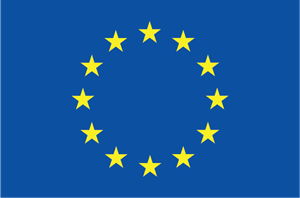

<!-- README.md is generated from README.Rmd. Please edit that file -->

```{r, include = FALSE}
knitr::opts_chunk$set(
  collapse = TRUE,
  comment = "#>",
  fig.path = "man/figures/README-",
  out.width = "100%"
)

library(DT)
```

# ediblecity

<!-- badges: start -->
[](https://zenodo.org/badge/latestdoi/404743169)
[](https://github.com/icra/edibleCity/actions/workflows/R-CMD-check.yaml)
[](https://CRAN.R-project.org/package=ediblecity)
<!-- [](https://app.codecov.io/gh/icra/edibleCity?branch=master) -->
[](https://lifecycle.r-lib.org/articles/stages.html#experimental)
<!-- badges: end -->

The goal of ediblecity is to is to estimate the potential of UA to contribute to addressing several urban challenges at the city-scale. Within this aim, we followed the urban challenges defined by the Eklipse project that are followed for nearly all of the European projects focused on Nature-based Solutions. We selected 8 indicators directly related to one or several urban challenges.

## Installation

You can install the development version of ediblecity from [r-universe](https://r-universe.dev) with:

``` r
install.packages("ediblecity", repos = "jospueyo.r-universe.dev")
```

## Indicators estimated

The package provides eight indicators that estimate different benefits of urban agriculture:

- `food_production()`: Amount of food produced in the city.
- `green_capita()`: Green per capita can be computed as raw or as the difference among neighbourhoods.
- `green_distance()`: Distance to closest public green area larger than certain surface. It computes also the proportion of homes that are further than a specific threshold.
- `UHI()`: Urban heat island as a rasters (`stars` object) or as numeric values.
- `edible_jobs()`: Number of jobs created by commercial urban agriculture.
- `edible_volunteers()`: Number of volunteers involved in community urban agriculture.
- `no2_seq()`: Amount of NO<sub>2</sub> sequestered by urban green (in gr/s).
- `runoff_prev()`: Runoff in the city after a specific rain event. It also computes the amount of rainwater harvested by urban agriculture initiatives.


## Set a scenario

Although `ediblecity` can also estimate indicators directly from an `sf` object, the function `set_scenario` provides a basic tool to create an scenario combining different proportions of elements of urban agriculture. Some warnings are triggered when the function can't satisfy the parameters passed by the user.

```{r example}
library(ediblecity)

scenario <- set_scenario(city_example,
                         pGardens = 0.7,
                         pVacant = 0.8,
                         pRooftop = 0.6,
                         pCommercial = 0.5)
```
All attributes of urban agriculture elements are included in `city_land_uses` dataframe. This can be used as default. Otherwise, a customized dataframe can be provided to compute each indicator.

```{r city_land_uses}

knitr::kable(city_land_uses)

```

## Contributors

Contributions are welcome! Some of the existing indicators can be improved as well as new indicators can be created. Likewise, the creation of new scenarios can include new elements of urban agriculture or provide further customization.

Scientific collaborations are also welcome! Check my research profile at [Google scholar](https://scholar.google.com/citations?user=zP9DBLMAAAAJ&hl=ca).

## Acknowledgements

<p align="center">


</p>

 This research was funded by Edicitnet project (grant agreement nº 776665)
