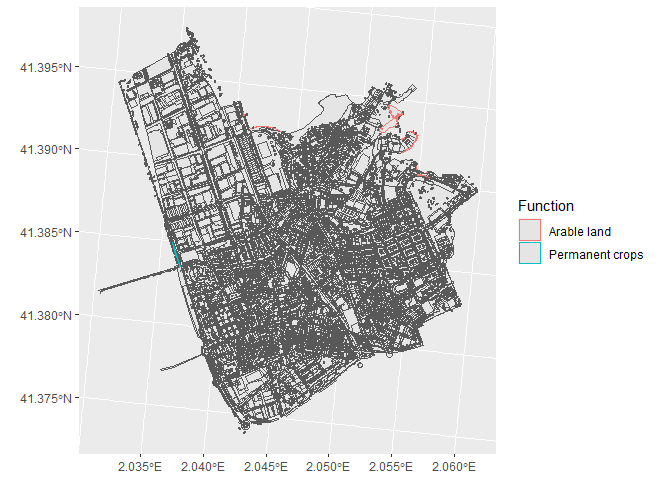
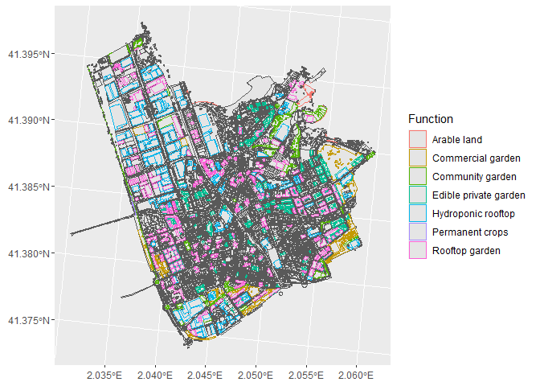
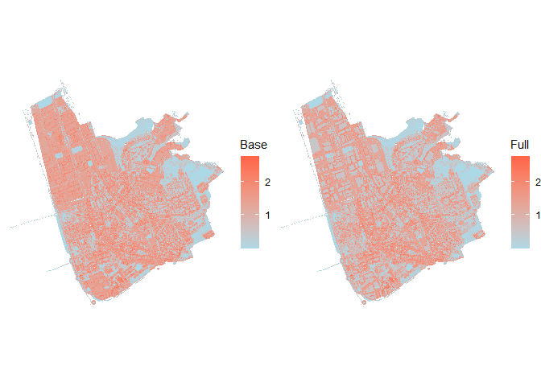

ediblecity R package
================
Josep Pueyo-Ros
2022-01-25

This package has not been released on CRAN. However, you can install it
directly from Github:

``` r
devtools::install_github("icra/edibleCity")
```

### LOADING EXAMPLE DATA

The package comes with a toy dataset based on actual conditions of Sant
Feliu de Llobregat, an average city in the Metropolitan area of
Barcelona (Catalonia, Spain). The dataset contains an `sf` object called
`city_example` and a `data.frame` with parameters used by indicators
called `city_functions`.

``` r
library(ediblecity)
library(tidyverse)
library(stars)
library(patchwork)
set.seed(1119)

ggplot(city_example)+
  geom_sf()+
  geom_sf(data= filter(city_example, Function %in% city_functions$functions[city_functions$edible]), aes(color=Function))
```

<!-- -->

### DEFINING SCENARIOS

The function ‘set\_scenario’ converts parts of the city in urban
agriculture initiatives according to defined parameters in the the
function. The function warns the user if some parameters are
constraining the result.

``` r
full <- set_scenario(city_example,
                     pGardens = 1,
                     pVacant = 1,
                     pRooftop = 1,
                     perc_garden = c(0.02, 0.3),
                     perc_vacant = c(0.52, 0.75),
                     perc_rooftop = c(0.6, 0.62),
                     min_area_garden = 10,
                     min_area_vacant = 100,
                     min_area_rooftop = 100,
                     private_gardens_from = "Normal garden",
                     vacant_from = "Vacant",
                     rooftop_from = "Rooftop",
                     pCommercial = 0.25,
                     area_field = "flat_area"
             )
```

    ## Warning in set_scenario(city_example, pGardens = 1, pVacant = 1, pRooftop = 1, : Only 182 private gardens out of 1344 assumed satisfy the 'min_area_garden'

    ## Warning in set_scenario(city_example, pGardens = 1, pVacant = 1, pRooftop = 1, : Only 57 vacant plots out of 79 assumed satisfy the 'min_area_vacant'

    ## Warning in set_scenario(city_example, pGardens = 1, pVacant = 1, pRooftop = 1, : Only 339 rooftops out of 2432 assumed satisfy the 'min_area_rooftop'

``` r
for (f in city_functions$functions[city_functions$edible]){
  print(paste(f,"=", sum(full$Function == f)))
}
```

    ## [1] "Edible private garden = 182"
    ## [1] "Commercial garden = 15"
    ## [1] "Community garden = 42"
    ## [1] "Hydroponic rooftop = 85"
    ## [1] "Rooftop garden = 254"
    ## [1] "Arable land = 3"
    ## [1] "Permanent crops = 2"

``` r
ggplot()+
  geom_sf(data=full)+
  geom_sf(data= filter(full, Function %in% city_functions$functions[city_functions$edible]), aes(color=Function))
```

<!-- -->

### ESTIMATION OF JOBS CREATED BY URBAN AGRICULTURE

The jobs are a function of the surface used for commercial gardens and
rooftops to grow up plants. It simulates a random uniform distribution
based on the range provided and returns the 95% confidence interval.

``` r
edible_jobs(  
  full,
  jobs = c(0.000163, 0.022),
  area_col = "flat_area",
  interval = 0.95)
```

    ##        5%       50%       95% 
    ##  432.1023 3932.0483 7750.8711

### ESTIMATION OF VOLUNTEERS INVOLVED IN URBAN AGRICULTURE

The number of volunteers is a function of the surface used for
commercial gardens and rooftops to grow up plants. It simulates a random
uniform distribution based on the range provided and returns the 95%
confidence interval.

``` r
edible_volunteers(  
  full,
  volunteers = c(0.00163, 0.22),
  area_col = "flat_area",
  interval = 0.95)
```

    ##        5%       50%       95% 
    ##  1862.882 14615.849 27267.582

### ESTIMATION OF GREEN PER CAPITA

The function calculates the amount of green surface in the city (edible
and non-edible) and divides per inhabitants. It can calculate the value
per neighbourhood as well as the proportion between the greenest
neighbourhood and the least green one. The neighbourhoods of the toy
dataset are also provided as `neighbourhoods`.

#### BASE SCENARIO

``` r
# Green per capita in m2
base_m2 <- green_capita(city_example, inhabitants = 44474, private = F)
# Ratio of green per capita between highest and lowest neighbourhood
base_p <- green_capita(city_example, 
             neighbourhoods = neighbourhoods, 
             name_col = 'name',
             inh_col = 'inhabitants',
             verbose = F,
             min_inh = 300,
             private = T)
#Values by neighbourhood
base_table <- green_capita(city_example, 
             neighbourhoods = neighbourhoods, 
             name_col = 'name',
             inh_col = 'inhabitants',
             verbose = T, 
             private = F)

#Green per capita in the whole city
base_m2
```

    ## [1] 4.710664

``` r
#Proportion between extreme values in neihbourhoods
base_p
```

    ## [1] 0.02685679

``` r
base_table
```

    ## # A tibble: 13 x 4
    ##    name                area inhabitants green_capita
    ##    <chr>              <dbl>       <int>        <dbl>
    ##  1 Afores - est      46566.          17     2739.   
    ##  2 Afores - oest     14468.          18      804.   
    ##  3 Can Bertrand       1224.        1632        0.750
    ##  4 Can Calders       15032.        6118        2.46 
    ##  5 Can Llobera         579.        1319        0.439
    ##  6 Can Maginàs         567.         692        0.820
    ##  7 Can Nadal         11123.        7050        1.58 
    ##  8 El Pla            15413.           3     5138.   
    ##  9 Falguera          10596.        7824        1.35 
    ## 10 La Salut            988.        4423        0.223
    ## 11 Les Grases        40702.        1373       29.6  
    ## 12 Mas Lluí          43063.        5542        7.77 
    ## 13 Roses-Castellbell  4613.        8874        0.520

#### FULL SCENARIO

``` r
# Green per capita in m2
full_m2 <- green_capita(full, inhabitants = 44474, private = F)
# Ratio of green per capita between highest and lowest neighbourhood
full_p <- green_capita(full, 
             neighbourhoods = neighbourhoods, 
             name_col = 'name',
             inh_col = 'inhabitants',
             verbose = F,
             min_inh = 300, 
             private = F)
#Values by neighbourhood
full_table <- green_capita(full, 
             neighbourhoods = neighbourhoods, 
             name_col = 'name',
             inh_col = 'inhabitants',
             verbose = T,
             private = F)

#Green per capita in the whole city
full_m2
```

    ## [1] 9.419583

``` r
#Proportion between extreme values in neihbourhoods
full_p
```

    ## [1] 0.01399571

``` r
full_table
```

    ## # A tibble: 13 x 4
    ##    name                area inhabitants green_capita
    ##    <chr>              <dbl>       <int>        <dbl>
    ##  1 Afores - est      46566.          17     2739.   
    ##  2 Afores - oest     14861.          18      826.   
    ##  3 Can Bertrand      18669.        1632       11.4  
    ##  4 Can Calders       70585.        6118       11.5  
    ##  5 Can Llobera         579.        1319        0.439
    ##  6 Can Maginàs        1926.         692        2.78 
    ##  7 Can Nadal         31406.        7050        4.45 
    ##  8 El Pla            66938.           3    22313.   
    ##  9 Falguera          31567.        7824        4.03 
    ## 10 La Salut           7595.        4423        1.72 
    ## 11 Les Grases        43093.        1373       31.4  
    ## 12 Mas Lluí          58082.        5542       10.5  
    ## 13 Roses-Castellbell 22490.        8874        2.53

<!-- -->

### DISTANCE TO GREEN

This indicator calculates the distance from each residence to its
closest public green areas larger than ‘min\_area’. It can return the
summary of distances or the percentage of residence buildings further
than a defined distance `max_dist`.

#### BASE SCENARIO

``` r
#Distance to closest public green area
base_summary <- green_distance(city_example,
                               min_area = 5000,
                               percent_out = F,
                               max_dist = 300,
                               verbose = F)

#Percentage of houses further than 300 meters
base_percent <- green_distance(city_example,
                               min_area = 5000,
                               percent_out = T,
                               max_dist = 300,
                               verbose = F)

#All distances
base_dist <- green_distance(city_example,
                               min_area = 5000,
                               percent_out = T,
                               max_dist = 300,
                               verbose = T)
```

#### FULL SCENARIO

``` r
#Distance to closest public green area
full_summary <- green_distance(full,
                               min_area = 5000,
                               percent_out = F,
                               max_dist = 300,
                               verbose = F)

#Percentage of houses further than 300 meters
full_percent <- green_distance(full,
                               min_area = 5000,
                               percent_out = T,
                               max_dist = 300,
                               verbose = F)

#All distances
full_dist <- green_distance(full,
                               min_area = 5000,
                               percent_out = T,
                               max_dist = 300,
                               verbose = T)
base_summary
```

    ##      Min.   1st Qu.    Median      Mean   3rd Qu.      Max. 
    ##    0.0008  393.5716  532.9162  527.6503  678.2837 1000.2572

``` r
full_summary
```

    ##      Min.   1st Qu.    Median      Mean   3rd Qu.      Max. 
    ##    0.0008  388.6373  522.0792  523.5677  677.2693 1000.2572

``` r
base_percent
```

    ## [1] 0.8531469

``` r
full_percent
```

    ## [1] 0.8516484

``` r
colors <- c("Base scenario" = rgb(5,34,255,125, maxColorValue = 255), 
            "Full scenario" = rgb(245,72,66, 125, maxColorValue = 255))

data.frame(base = as.numeric(base_dist), full = as.numeric(full_dist)) %>% 
  ggplot()+
    geom_histogram(aes(base, fill = "Base scenario"))+
    geom_histogram(aes(full, fill = 'Full scenario'))+
    scale_fill_manual(values = colors)
```

<!-- -->

### URBAN HEAT ISLAND

The indicator calculates de urban heat island (UHI) following Theeuwes,
N. E., Steeneveld, G. J., Ronda, R. J., & Holtslag, A. A. M. (2017). A
diagnostic equation for the daily maximum urban heat island effect for
cities in northwestern Europe. International Journal of Climatology,
37(1), 443-454. <https://doi.org/10.1002/joc.4717>

You can download the SVF raster for the toy dataset in
[Zenodo](https://zenodo.org/record/5900970)

#### BASE SCENARIO

``` r
SVF <- stars::read_stars("SVF.tif")

uhi <- UHI(city_example, SVF = SVF, return_raster = T)
uhi2 <- UHI(full, SVF = SVF, return_raster = T)

names(uhi) <- "Base"
names(uhi2) <- "Full"

p_custom <- theme_set(theme_void())+
  theme(axis.ticks = element_blank(), axis.text = element_blank(), axis.title = element_blank(),
        axis.line = element_blank())


rast_plot <- function(raster){  
  return(ggplot()+
          geom_stars(data = raster)+
          scale_fill_gradient(low="lightblue", high = "tomato", na.value = "white")+
          coord_equal()+
          theme_void())
}
  
p1 <- rast_plot(uhi)
p2 <- rast_plot(uhi2)

stars_sum <- function(x){return(summary(dplyr::as_tibble(x)[[3]]))}
cat("Base scenario\n")
```

    ## Base scenario

``` r
stars_sum(uhi)
```

    ##    Min. 1st Qu.  Median    Mean 3rd Qu.    Max.    NA's 
    ##    0.00    0.51    1.26    1.07    1.45    2.75  141980

``` r
cat("Full scenario\n")
```

    ## Full scenario

``` r
stars_sum(uhi2)
```

    ##    Min. 1st Qu.  Median    Mean 3rd Qu.    Max.    NA's 
    ##    0.00    0.49    1.01    0.95    1.40    2.75  141980

``` r
p1 + p2
```

<!-- -->

### NO2 SEQUESTRATION

This indicator returns the amount of NO2 that is sequestered by urban
green.

``` r
no2_base <- no2_seq(city_example)
no2_full <- no2_seq(full)

cat("NO2 sequestration in base scenario\n")
```

    ## NO2 sequestration in base scenario

``` r
no2_base
```

    ##     gr/s 
    ## 125.6669

``` r
cat("NO2 sequestration in full scenario\n")
```

    ## NO2 sequestration in full scenario

``` r
no2_full
```

    ##     gr/s 
    ## 148.0751

### FOOD PRODUCTION

This indicator estimates the food (in kg/year) produced by urban
agriculture initiatives in your city. It uses a range of production for
each type of initiative to create the median and the confidence interval
of the number of jobs by simulating a random uniform distribution of
1000 values within the provided range.

``` r
food_base <- food_production(city_example)
food_full <- food_production(full)
consumption <- 44474*73

cat("Ratio of consumption vs production\n")
```

    ## Ratio of consumption vs production

``` r
cat("\nBase scenario\n")
```

    ## 
    ## Base scenario

``` r
round(food_base / consumption, 3)
```

    ##    5%   50%   95% 
    ## 0.009 0.011 0.013

``` r
cat("\nFull scenario\n")
```

    ## 
    ## Full scenario

``` r
round(food_full / consumption, 3)
```

    ##    5%   50%   95% 
    ## 0.301 0.402 0.508

### RUNOFF PREVENTION

This indicator calculates the runoff in the city using the SCS runoff
curve number method developed by NRCS. The method is modified to
properly include rainwater harvested. When curve numbers depend on soil
conditions, the indicator use a random number within the range. The tank
size for rainwater storage is also randomized based on `tank_size`
parameter.

``` r
#runoff prevention

runoff_base <- runoff_prev(city_example)
runoff_full <- runoff_prev(full)

results <- tribble(
  ~scenario, ~runoff, ~rain_harvested,
  "Base", runoff_base[[1]], runoff_base[[3]],
  "Full", runoff_full[[1]], runoff_full[[3]]
)

runoff_plot <- ggplot(results, aes(x=scenario, y=runoff, fill=scenario))+
  geom_col(show.legend = F)+
  labs(x="Scenario", y = "runoff (mm)")

rh_plot <- ggplot(results, aes(x=scenario, y=rain_harvested, fill=scenario))+
  geom_col(show.legend = F)+
  labs(x="Scenario", y = "rain harvested (cubic metres)")

wrap_plots(list(runoff_plot, rh_plot))
```

<!-- -->
