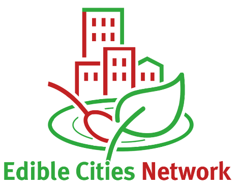

# ediblecity 0.2.1.900

The goal of ediblecity is to is to estimate the potential of UA to
contribute to addressing several urban challenges at the city-scale.
Within this aim, we followed the urban challenges defined by the Eklipse
project that are followed for nearly all of the European projects
focused on Nature-based Solutions. We selected 8 indicators directly
related to one or several urban challenges.

## Installation

You can install the last LTR version from CRAN:

``` r
install.packages("ediblecity")
```

Alternatively, you can install the development version of ediblecity
from [r-universe](https://r-universe.dev) with:

``` r
install.packages("ediblecity", repos = "jospueyo.r-universe.dev")
```

## Indicators estimated

The package provides eight indicators that estimate different benefits
of urban agriculture:

- [`food_production()`](https://icra.github.io/ediblecity/reference/food_production.md):
  Amount of food produced in the city.
- [`green_capita()`](https://icra.github.io/ediblecity/reference/green_capita.md):
  Green per capita can be computed as raw or as the difference among
  neighbourhoods.
- [`green_distance()`](https://icra.github.io/ediblecity/reference/green_distance.md):
  Distance to closest public green area larger than certain surface. It
  computes also the proportion of homes that are further than a specific
  threshold.
- [`UHI()`](https://icra.github.io/ediblecity/reference/UHI.md): Urban
  heat island as a rasters (`stars` object) or as numeric values.
- [`edible_jobs()`](https://icra.github.io/ediblecity/reference/edible_jobs.md):
  Number of jobs created by commercial urban agriculture.
- [`edible_volunteers()`](https://icra.github.io/ediblecity/reference/edible_volunteers.md):
  Number of volunteers involved in community urban agriculture.
- [`no2_seq()`](https://icra.github.io/ediblecity/reference/no2_seq.md):
  Amount of NO₂ sequestered by urban green (in gr/s).
- [`runoff_prev()`](https://icra.github.io/ediblecity/reference/runoff_prev.md):
  Runoff in the city after a specific rain event. It also computes the
  amount of rainwater harvested by urban agriculture initiatives.

## Set a scenario

Although `ediblecity` can also estimate indicators directly from an `sf`
object, the function `set_scenario` provides a basic tool to create an
scenario combining different proportions of elements of urban
agriculture. Some warnings are triggered when the function can’t satisfy
the parameters passed by the user.

``` r
library(ediblecity)

scenario <- set_scenario(city_example,
                         pGardens = 0.7,
                         pVacant = 0.8,
                         pRooftop = 0.6,
                         pCommercial = 0.5)
#> Only 328 rooftops out of 362.4 assumed satisfy the 'min_area_rooftop'
```

All attributes of urban agriculture elements are included in
`city_land_uses` dataframe. This can be used as default. Otherwise, a
customized dataframe can be provided to compute each indicator.

``` r

knitr::kable(city_land_uses)
```

| land_uses             | edible | public | pGreen | jobs  | volunteers | location | no2_seq1 | no2_seq2 | food1 | food2 | CN1 | CN2 | water_storage1 | water_storage2 | water_storage |
|:----------------------|:-------|:-------|-------:|:------|:-----------|:---------|---------:|---------:|------:|------:|----:|----:|---------------:|---------------:|:--------------|
| Edible private garden | TRUE   | FALSE  |    0.6 | FALSE | FALSE      | garden   |     0.07 |     0.09 |   0.2 |   6.6 |  85 |  88 |              0 |             10 | TRUE          |
| Community garden      | TRUE   | TRUE   |    1.0 | FALSE | TRUE       | vacant   |     0.07 |     0.09 |   0.2 |   2.2 |  85 |  88 |              0 |             10 | TRUE          |
| Commercial garden     | TRUE   | FALSE  |    1.0 | TRUE  | FALSE      | vacant   |     0.07 |     0.09 |   4.0 |   6.6 |  85 |  85 |              0 |             10 | TRUE          |
| Rooftop garden        | TRUE   | TRUE   |    1.0 | FALSE | TRUE       | rooftop  |     0.07 |     0.07 |   0.2 |   2.2 |  67 |  88 |              0 |             10 | TRUE          |
| Hydroponic rooftop    | TRUE   | FALSE  |    1.0 | TRUE  | FALSE      | rooftop  |     0.07 |     0.07 |   9.0 |  19.0 |  98 |  98 |              0 |             10 | TRUE          |
| Arable land           | TRUE   | FALSE  |    0.6 | FALSE | FALSE      | no       |     0.00 |     0.07 |   4.0 |   6.6 |  85 |  88 |              0 |              0 | FALSE         |
| Normal garden         | FALSE  | FALSE  |    0.6 | FALSE | FALSE      | no       |     0.07 |     0.07 |   1.0 |   1.0 |  74 |  86 |              0 |             10 | TRUE          |
| Permanent crops       | TRUE   | FALSE  |    0.6 | FALSE | FALSE      | no       |     0.09 |     0.09 |   4.0 |   6.6 |  65 |  77 |              0 |              0 | FALSE         |
| Vacant                | FALSE  | FALSE  |    1.0 | FALSE | FALSE      | no       |     0.07 |     0.09 |   1.0 |   1.0 |  74 |  87 |              0 |              0 | FALSE         |
| Grass                 | FALSE  | TRUE   |    1.0 | FALSE | FALSE      | no       |     0.07 |     0.07 |   1.0 |   1.0 |  74 |  86 |              0 |              0 | FALSE         |
| Mulcher               | FALSE  | TRUE   |    1.0 | FALSE | FALSE      | no       |     0.00 |     0.00 |   1.0 |   1.0 |  88 |  88 |              0 |              0 | FALSE         |
| Raised bed            | FALSE  | TRUE   |    1.0 | FALSE | FALSE      | no       |     0.07 |     0.07 |   1.0 |   1.0 |  67 |  88 |              0 |              0 | FALSE         |
| Trees                 | FALSE  | FALSE  |    1.0 | FALSE | FALSE      | no       |     0.11 |     0.11 |   1.0 |   1.0 |  70 |  77 |              0 |              0 | FALSE         |
| Vegetated pergola     | FALSE  | TRUE   |    1.0 | FALSE | FALSE      | no       |     0.07 |     0.07 |   1.0 |   1.0 |  98 |  98 |              0 |              0 | FALSE         |

## Contributors

Contributions are welcome! Some of the existing indicators can be
improved as well as new indicators can be created. Likewise, the
creation of new scenarios can include new elements of urban agriculture
or provide further customization.

Scientific collaborations are also welcome! Check my research profile at
[Google
scholar](https://scholar.google.com/citations?user=zP9DBLMAAAAJ&hl=ca).

## Acknowledgements



 This research was funded by
Edicitnet project (grant agreement nº 776665)
